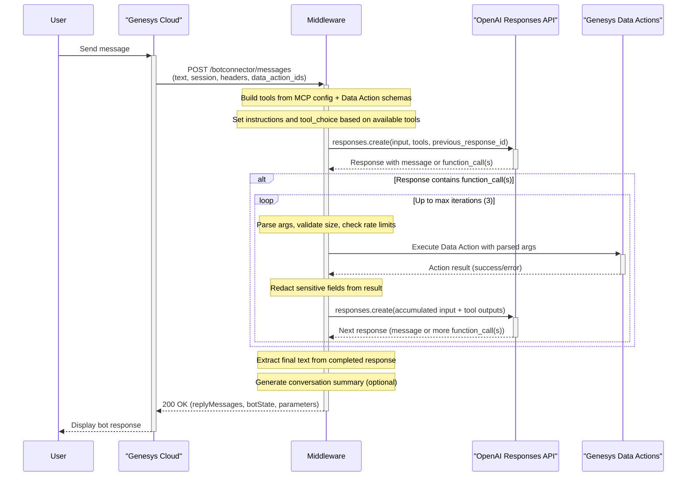
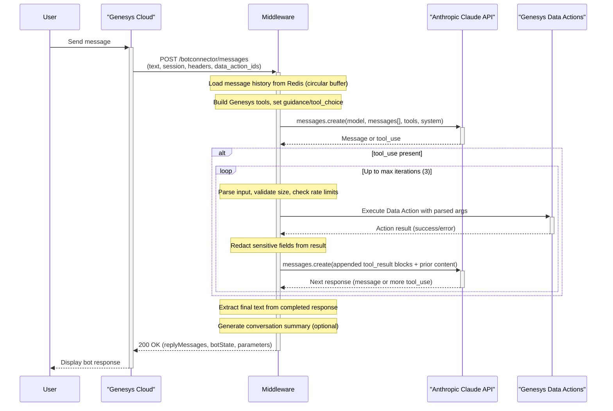

# Genesys Cloud Digital Bot Connector & Multi-Vendor AI Responses Middleware

## 1. Overview

Middleware connecting the Genesys Cloud Digital Bot Connector (v2) to multiple AI vendors (OpenAI Responses API and Anthropic Claude API). It provides a secure bridge for Architect flows to call generative models, with session management, Genesys Data Actions tool‑calling, safeguards, dynamic per‑turn configuration.

This enables a truly agentic offering available for all native Genesys Cloud messaging channels.

More info about Genesys Cloud Digital Bot Connector: https://help.mypurecloud.com/articles/about-genesys-digital-bot-connector

More info about OpenAI Responses API: https://platform.openai.com/docs/api-reference/responses

More info about Anthropic Claude API: https://docs.anthropic.com/

### Features at a glance

- **Multi‑vendor**: Switch between OpenAI and Claude with `AI_VENDOR`.
- **Conversation state**: OpenAI uses `previous_response_id`; Claude uses stored message history. Both are keyed by `genesysConversationId` and persisted with TTL, ensuring complete isolation between conversations with zero cross-contamination.
- **Prompt caching**: Fully optimized for both vendors. OpenAI uses `prompt_cache_key` for intelligent routing; Claude uses strategic `cache_control` breakpoints on tools, system, and messages. Reduces latency up to 80% and costs up to 90% automatically.
- **Genesys Data Actions as tools**: Per‑turn allowlist via `data_action_ids` with human‑readable descriptions via `data_action_descriptions`; fetch schemas in parallel; optional strict schemas; redaction; bounded tool loop; per‑conversation rate limits; retries/timeouts.
- **Universal termination tools**: LLM autonomously decides when to escalate to human agent or gracefully end successful conversations.
- **MCP tools (OpenAI only)**: Load external MCP servers from `mcp_config.json` at runtime.
- **Dynamic behavior**: Architect session variables override model, temperature, tools, and instructions per turn and persist automatically.
- **Observability**: Structured logs and optional in‑process metrics.
- **Security**: Request authentication with `GENESYS_CONNECTION_SECRET`; API keys never logged.
- **Outputs**: `escalation_required`, `task_accomplished`, optional `conversation_summary`, `escalation_reason`, and `completion_summary`.

## 2. Architecture

The middleware acts as a translation layer, following a simple, linear flow between the Genesys Cloud and OpenAI/Claude APIs.

### OpenAI flow



### Claude flow



## 3. API Endpoints

Implements the Genesys Digital Bot Connector specification (https://developer.genesys.cloud/commdigital/textbots/digital-botconnector-customer-api-spec).

### GET /botconnector/bots
Returns the list of available bot configurations for the current `AI_VENDOR`.

### GET /botconnector/bots/{botId}
Returns details for a specific bot configuration.

### POST /botconnector/messages
Processes an incoming message, calls the selected vendor, manages the tool loop, and returns a reply.

## 4. Request & Response Mapping

### Genesys → OpenAI (Responses API)

| Genesys Field | OpenAI Field | Logic / Notes |
|---|---|---|
| `genesysConversationId` | Redis session key | Used as the Redis key for session isolation; ensures zero cross-contamination between conversations. |
| `genesysConversationId` | `previous_response_id` | Maps `genesysConversationId` to the last OpenAI `response.id` to maintain context within a single conversation. |
| `genesysConversationId` | `metadata` | `{ "genesys_conversation_id": "<value>" }`. |
| Header `OPENAI_API_KEY` | Header `Authorization` | `Bearer <OPENAI_API_KEY>`. |
| `inputMessage.text` | `input` (string) | Primary user message. |
| `parameters` | `model`, `temperature`, `tools`, `instructions`, `tool_choice` | `ai_model`/`ai_temperature` override defaults. Tools from MCP + Genesys Data Actions. |
| MCP Servers | `tools` | Loaded when `MCP_SERVERS_CONFIG_PATH` is set. |

### Genesys → Claude (Messages API)

| Genesys Field | Claude Field | Logic / Notes |
|---|---|---|
| `genesysConversationId` | Redis session key | Used as the Redis key for session isolation; ensures zero cross-contamination between conversations. |
| `genesysConversationId` | `messages` history | History loaded from Redis (keyed by `genesysConversationId`) and prepended; `previous_response_id` is not used by Claude. |
| Header `ANTHROPIC_API_KEY` | Header `x-api-key` | Sent by SDK; key provided at client init. |
| `inputMessage.text` | `messages[0]` | Primary user message. |
| `parameters` | `model`, `tools`, `system`, `tool_choice` | `ai_model` overrides default; temperature is ignored. Genesys tools included when present. |

### Function Calling Flow (Genesys Data Actions)

1. Architect sets `parameters.data_action_ids` with a pipe‑separated list of Data Action IDs and `parameters.data_action_descriptions` with matching pipe‑separated descriptions for the current turn.
2. Middleware parses descriptions and maps them to action IDs. It fetches input/success schemas for each ID in parallel and builds one function tool per action, using custom descriptions when provided.
3. Initial model call includes tooling guidance and a restricted `tool_choice` when tools are present.
4. For each tool call: parse/validate args, enforce `GENESYS_MAX_TOOL_ARGUMENT_BYTES`, execute `POST /test` with retries/timeout, redact fields per `TOOL_OUTPUT_REDACTION_FIELDS`, and append as tool results.
5. Repeat until a final message is produced or `GENESYS_TOOL_LOOP_MAX_ITERATIONS` is reached.

### Universal Conversation Termination Tools

The middleware automatically includes two universal function tools in every request, enabling the LLM to autonomously decide when conversations should end based on conversation signals and customer interactions.

#### Autonomous Decision Making

The LLM uses its judgment to determine when to terminate conversations by recognizing natural signals:

**Escalation Signals:**
- Customer explicitly requests a human agent or live assistance
- Customer shows frustration, anger, or dissatisfaction
- The LLM cannot fulfill the request or resolve the customer's issue
- An error or system issue prevents task completion
- Request is outside the LLM's defined scope or capabilities

**Success Signals:**
- The customer's issue has been successfully resolved
- All required actions or steps have been completed
- Customer confirms satisfaction or indicates they are done
- Task is naturally concluded with a positive outcome

**Key Design Principles:**
- **Fully agentic**: The LLM autonomously determines when to terminate based on conversation context
- **No markers required**: Works naturally without special syntax or explicit triggers
- **Clear guidelines**: Specific scenarios help guide the LLM's judgment
- **Always available**: Termination tools are included in EVERY request, regardless of whether Genesys Data Action tools are present

#### Tool Specifications

**1. `end_conversation_with_escalation`**
- **When to Use**:
  - Customer explicitly requests a human agent or live assistance
  - Customer shows frustration, anger, or dissatisfaction
  - You cannot fulfill the request or resolve the issue
  - An error or system issue prevents task completion
  - Request is outside your defined scope or capabilities
- **Behavior**: 
  - Sets `botState` to `Failed` (triggers Genesys failure path for agent escalation)
  - Sets `escalation_required` to `"true"`
  - Returns the `escalation_prompt` message to the customer (or default message)
  - Includes the escalation reason in output parameters
- **Intent**: Returns `DefaultIntent` to Genesys

**2. `end_conversation_successfully`**
- **When to Use**:
  - You have successfully resolved the customer's issue or request
  - All required actions or steps have been completed successfully
  - Customer confirms satisfaction or indicates they are done ("that's all", "thanks", "I'm done", etc.)
  - Task naturally concludes with positive outcome
- **Behavior**: 
  - Sets `botState` to `Complete` (gracefully closes bot session)
  - Sets `task_accomplished` to `"true"`
  - Returns the `success_prompt` message to the customer (or default message)
  - Provides a completion summary in output parameters
- **Intent**: Returns `DefaultIntent` to Genesys

#### Intent Resolution

Both termination tools return `DefaultIntent` (the only intent defined in the bot manifest) because Genesys requires:
- When `botState` is `Complete` or `Failed`, an intent must be present in the response
- If the intent is not found in the bot's declared intents list, Genesys treats it as an error and takes the failure path
- The routing behavior is determined by `botState` (`Complete` for success, `Failed` for escalation), not by the intent name
- This ensures compatibility with Genesys' intent validation while maintaining correct conversation flow termination

#### Cross-Vendor Compatibility

These tools work identically for both OpenAI and Claude vendors. The autonomous mechanism ensures the LLM can terminate conversations appropriately by naturally recognizing completion or escalation signals in the conversation flow.

## 5. Configuration

Environment variables control behavior. Defaults are safe; set only what you need. Required indicates whether the variable must be set for your chosen vendor/features.

| Variable | Required | Default | Description |
|---|---|---|---|
| `PORT` | Optional | — | Standard Next.js `PORT` for local runs; not used by app code. |
| `LOG_LEVEL` | Optional | `info` | Logging verbosity: `debug` | `info` | `warn` | `error`. |
| `GENESYS_CONNECTION_SECRET` | Yes | — | Shared secret validated on every request. |
| `AI_VENDOR` | Optional | `openai` | Select `openai` or `claude` for this deployment. |
| `OPENAI_API_KEY` | Cond. (OpenAI) | — | Required when `AI_VENDOR=openai`. |
| `DEFAULT_OPENAI_MODEL` | Optional | `gpt-4o` | Fallback OpenAI model when not overridden by session. |
| `DEFAULT_OPENAI_TEMPERATURE` | Optional | `0.7` | Ignored for GPT‑5 models. |
| `ANTHROPIC_API_KEY` | Cond. (Claude) | — | Required when `AI_VENDOR=claude`. |
| `DEFAULT_ANTHROPIC_MODEL` | Optional | `claude-haiku-4-5-20251001` | Fallback Claude model when not overridden by session. |
| `MCP_SERVERS_CONFIG_PATH` | Optional (OpenAI) | — | Path to `mcp_config.json` enabling MCP tools. Ignored for Claude. |
| `SESSION_STORE_TYPE` | Optional | `memory` | Use `redis` for production/serverless. |
| `REDIS_URL` | Cond. (when `SESSION_STORE_TYPE=redis`) | — | Redis connection string. |
| `ENABLE_GENESYS_FUNCTION_TOOLS` | Optional | `true` | Enable Genesys Data Actions as tools. |
| `GENESYS_CLIENT_ID` | Cond. (Tools) | — | Required to fetch/execute Data Actions. |
| `GENESYS_CLIENT_SECRET` | Cond. (Tools) | — | Required to fetch/execute Data Actions. |
| `GENESYS_REGION` | Optional | — | Derives default API/login hosts when no explicit URLs are set. |
| `GENESYS_BASE_URL` | Optional | — | Overrides API origin; otherwise derived from `GENESYS_REGION`. |
| `GENESYS_LOGIN_URL` | Optional | — | Overrides login origin; otherwise derived from `GENESYS_REGION`. |
| `GENESYS_ALLOWED_DATA_ACTION_IDS` | Optional | — | Comma‑separated allowlist for exposed action IDs. |
| `GENESYS_TOKEN_CACHE_TTL_SECONDS` | Optional | `3000` | Max cached OAuth TTL ceiling. |
| `GENESYS_HTTP_TIMEOUT_MS` | Optional | `10000` | HTTP timeout for Genesys requests. |
| `GENESYS_HTTP_RETRY_MAX` | Optional | `3` | Max retries for Genesys requests. |
| `GENESYS_HTTP_RETRY_BACKOFF_MS` | Optional | `250` | Initial exponential backoff (ms). |
| `GENESYS_TOOLS_STRICT_MODE` | Optional | `false` | Enforce strict JSON Schemas for tools. |
| `MAX_GENESYS_TOOLS_PER_TURN` | Optional | `20` | Cap number of function tools per turn. |
| `GENESYS_TOOL_LOOP_MAX_ITERATIONS` | Optional | `3` | Cap tool‑calling iterations per turn. |
| `TOOL_OUTPUT_REDACTION_FIELDS` | Optional | — | CSV of field paths to redact in tool results. |
| `GENESYS_MAX_ACTION_CALLS_PER_TURN` | Optional | `10` | Cap executed Data Actions per turn. |
| `GENESYS_MAX_TOOL_ARGUMENT_BYTES` | Optional | `16384` | Max size of tool arguments payload. |
| `ENABLE_METRICS` | Optional | `false` | Enable minimal in‑process metrics. |
| `GENESYS_ACTIONS_PER_MINUTE` | Optional | `30` | Per‑conversation action rate limit. |
| `MAX_CONVERSATION_HISTORY_MESSAGES` | Optional (Claude) | `20` | Max stored messages; applies to Claude history only. |

### Genesys Input Session Variables

Set these in Architect; they persist per conversation and override defaults:

- `ai_model` (String): Override model for the current vendor.
- `ai_temperature` (String): Override temperature where supported (ignored by GPT‑5 and Claude).
- `data_action_ids` (String): Comma‑separated or pipe‑separated list of Genesys Data Action IDs to expose as tools for this turn. Example: `custom_-_fe8e8565-74fc-49c1-879a-157a8b16bf89|custom_-_e9404cf6-1a4b-4b0d-8346-833d75e8ab72`
- `data_action_descriptions` (String): **Required when `data_action_ids` is set.** Pipe‑separated list of human‑readable descriptions for each Data Action, in the same order as `data_action_ids`. Each description should explain what the action does, when to use it, and what it returns. This provides the LLM with essential business context that schemas alone cannot convey. Example: `Use this function to look up and retrieve the details of a customer's train ticket when they provide a ticket reference number. It returns the customer's name and the original journey details.|Use this function to check the availability of a new travel time for a customer's existing ticket.`
- `system_prompt` (String): Additional instructions combined with tooling guidance when tools are present.
- `escalation_prompt` (String): The final message the LLM will say to the customer before escalating to a human agent. Default: "I will transfer you to a human agent who can better assist you." Example: "Let me connect you with one of our specialists who can help you better with this request."
- `success_prompt` (String): The final message the LLM will say to the customer when successfully completing the conversation. Default: "I'm glad I could help you today. Have a great day!" Example: "Your request has been completed successfully. Is there anything else I can help you with today?"

#### Session Variable Persistence

- First request stores variables alongside context in Redis.
- Subsequent requests reuse stored variables even if omitted by Genesys.
- Cleanup is automatic via the `botSessionTimeout` TTL provided by Genesys.

### Genesys Output Session Variables

The middleware **always** returns the following variables in the response `parameters`. These parameters are present in every response:

- `escalation_required` (String): Set to "true" when the LLM determines human escalation is needed (customer requested agent, shows frustration, or issue cannot be resolved), "false" otherwise.
- `task_accomplished` (String): Set to "true" when the LLM successfully resolves the customer's issue and gracefully terminates the session, "false" otherwise.
- `conversation_summary` (String): Compact conversation summary (empty string if not available).
- `escalation_reason` (String): Brief explanation of why escalation was needed (populated when `escalation_required` is "true", empty string otherwise).
- `completion_summary` (String): Brief summary of what was accomplished (populated when `task_accomplished` is "true", empty string otherwise).

#### Output Parameters Behavior

**When Termination Functions Are Called:**
- All output parameters are properly populated with meaningful values
- `escalation_required` / `task_accomplished` set to `"true"` as appropriate
- Summary fields contain actual summaries from the LLM
- `botState` is set to `Complete` or `Failed` to end the conversation

**When Conversation Continues (No Termination):**
- Output parameters contain default/empty values
- `escalation_required` = `"false"`, `task_accomplished` = `"false"`
- Summary fields may contain auto-generated summaries or empty strings
- `botState` is `MoreData` to keep the conversation open

**Important:** Meaningful output parameter values (especially `escalation_required="true"` or `task_accomplished="true"`) are ONLY set when the LLM explicitly calls the termination functions. This ensures Architect flows receive accurate signals about conversation outcomes.

### Example `mcp_config.json`

```json
[
  {
    "type": "mcp",
    "server_label": "deepwiki",
    "server_url": "https://mcp.deepwiki.com/mcp",
    "require_approval": "never"
  },
  { "type": "web_search_preview" }
]
```

## 6. Security

### Connection Secret
The `GENESYS_CONNECTION_SECRET` header is validated on every `POST /botconnector/messages` request. Mismatches return `403 Forbidden`.

### API Key Handling
Vendor API keys are supplied via environment variables to SDK clients and are never logged.

## 7. Session Management

### State store (Redis)
Short‑lived serverless instances require external persistence. The middleware stores `previousResponseId`, optional Claude `messageHistory`, and session variables in Redis keyed by **`genesysConversationId`**, with TTL based on `botSessionTimeout`.

### Conversation Isolation
Each Genesys conversation is guaranteed to be completely isolated with zero cross-contamination:
- **Session key**: `genesysConversationId` is used as the Redis key (unique per conversation)
- **Fresh start**: Each new conversation starts with empty state unless data exists for that specific `genesysConversationId`
- **Clean boundaries**: Session data is automatically cleaned up after TTL expiration
- **Logging**: Explicit logs indicate whether a conversation is "continuing" (data found) or "starting fresh" (no data)

### History and cost
- OpenAI: Context is chained by `previous_response_id`; messages are not explicitly resent.
- Claude: Message history is stored and trimmed to `MAX_CONVERSATION_HISTORY_MESSAGES`.

## 8. Vendor-Specific Features

### OpenAI
- Responses API with `previous_response_id`
- Temperature supported except for GPT‑5
- MCP tools supported
- **Prompt Caching**: Automatically enabled for prompts 1024+ tokens. The middleware uses `prompt_cache_key` (set to `genesysConversationId`) to improve cache hit rates by routing requests with shared prefixes to the same servers. No code changes required; caching reduces latency by up to 80% and input costs by up to 90%.

### Anthropic Claude
- Messages API with history
- Temperature ignored
- MCP tools not supported; Genesys Data Actions as tools
- **Prompt Caching**: Automatically enabled with `cache_control` blocks on:
  - System instructions (marked with `cache_control: { type: "ephemeral" }`)
  - Last tool definition (caches all tool definitions)
  - Last user message content (enables incremental conversation caching)
  - Cache lifetime: 5 minutes (refreshed on each use). Reduces latency and costs with 90% discount on cached tokens.

### Switching vendors
1) Set `AI_VENDOR`, 2) set vendor API key, 3) set default model if needed, 4) redeploy.

### Prompt Caching Details

Both OpenAI and Claude implementations are fully optimized for prompt caching to minimize latency and costs:

#### How It Works

**OpenAI (Automatic)**
- Caching activates automatically for prompts containing 1024+ tokens
- Requests are routed to servers based on prompt prefix hash and `prompt_cache_key`
- The middleware sets `prompt_cache_key` to `genesysConversationId`, ensuring requests for the same conversation are routed to the same server
- Cache hits occur in 128-token increments (1024, 1152, 1280, etc.)
- Cache lifetime: 5-10 minutes (up to 1 hour during off-peak)
- **Pricing**: Cached tokens cost 90% less than regular input tokens (no additional write fees)
- **No code changes required** - works automatically on all API requests

**Claude (Optimized Structure)**
- Cache breakpoints strategically placed at three levels:
  1. **Tools**: Last tool definition marked with `cache_control` (caches all tools)
  2. **System**: Instructions block marked with `cache_control` (caches system prompt)
  3. **Messages**: Last user message content marked with `cache_control` (caches conversation history)
- Minimum cacheable prompt: 1024 tokens for Sonnet/Opus models, 2048 for Haiku models
- Cache lifetime: 5 minutes (refreshed on each use)
- **Pricing**: Cache writes cost 25% more than base input tokens; cache reads cost 90% less
- The automatic prefix checking looks back ~20 content blocks, so a single breakpoint at the end is often sufficient

#### Cache Invalidation

Understanding what breaks the cache helps maximize cache hit rates:

**OpenAI**
- Changing any part of the prompt prefix before the 1024-token threshold
- Modifying the `prompt_cache_key` value
- Cache naturally expires after 5-10 minutes of inactivity

**Claude**
- Modifying tool definitions invalidates tools cache and all subsequent levels
- Changing system instructions invalidates system and message caches
- Modifying conversation history only invalidates the messages cache level
- Enabling/disabling features that modify the system prompt (e.g., citations, web search)
- Cache expires after 5 minutes of inactivity

#### Performance Benefits

In production, prompt caching delivers:
- **Latency reduction**: Up to 80% faster response times for cached prompts
- **Cost reduction**: Up to 90% savings on input token costs for cache hits
- **Throughput increase**: Higher rate limits since cached tokens don't count toward TPM limits (OpenAI)
- **Conversation continuity**: Efficient multi-turn conversations with full context retention

#### Best Practices

The middleware automatically follows prompt caching best practices:
- **Static content first**: System prompts and tool definitions are placed at the beginning
- **Dynamic content last**: User messages are placed at the end to maximize cache reuse
- **Consistent keys**: `genesysConversationId` ensures related requests hit the same cache
- **Appropriate breakpoints**: Claude's three cache levels (tools → system → messages) optimize for different update frequencies
- **History management**: Conversation history is trimmed to `MAX_CONVERSATION_HISTORY_MESSAGES` to prevent cache bloat

## 9. Deployment and Setup

### Vercel
1) Link repo; 2) set env vars; 3) configure Redis; 4) deploy.

### Genesys Cloud
Configure the Bot Connector URI to your deployment and set `GENESYS_CONNECTION_SECRET`. Use `data_action_ids` in flows to enable tools.

## 10. Observability & Limits
- Structured logs; never log secrets.
- Optional metrics via `ENABLE_METRICS`.
- Safeguards: bounded tool loop, tool and call caps, argument size limits, and per‑conversation rate limiting.

## 11. Strict Mode (Optional)
Enable `GENESYS_TOOLS_STRICT_MODE=true` to enforce strict JSON Schemas for function tools. Use when upstream schemas are predictable.

